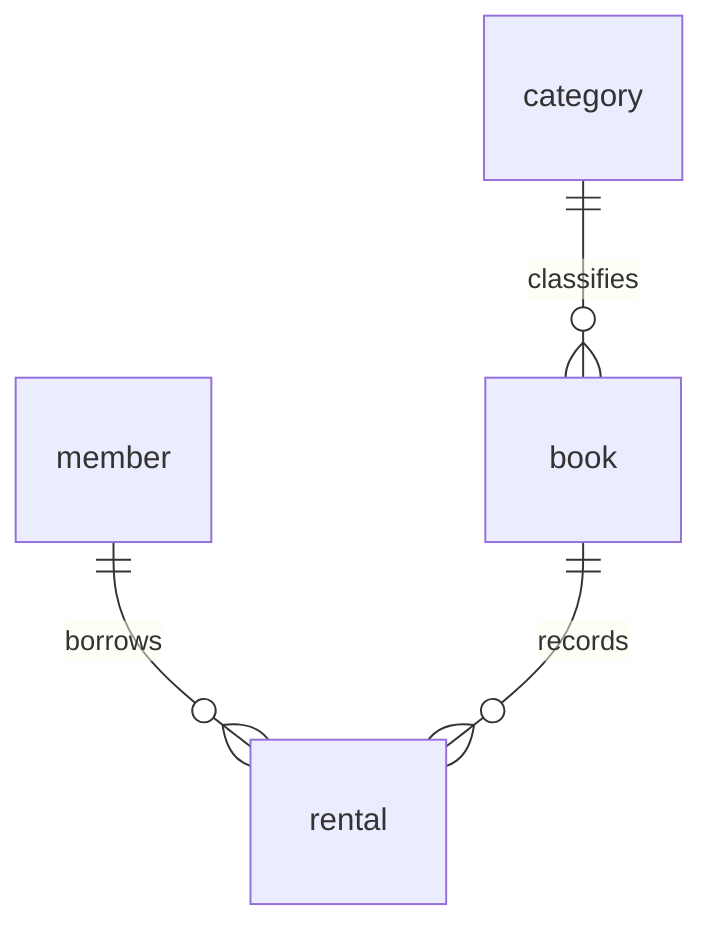

# B6-1: 정보를 깔끔하게 정리하는 디지털 서랍장 만들기

회원, 도서, 카테고리, 대여 기록으로 도서 대여 DB를 구성합니다. SQLite CLI로 스키마와 샘플 데이터를 만들고 조회, 조인, 집계, 서브쿼리, 수정/삭제, 인덱스를 실행합니다.

## 실행 방법

새 데이터베이스 파일에서 실행합니다. SQLite 3.35 이상이 필요합니다.

```bash
sqlite3 library.db < schema.sql
sqlite3 library.db < seed.sql
sqlite3 -header -column -echo library.db < queries.sql
```

SQLite의 FK 검증은 연결마다 활성화합니다. SQL 파일 첫 줄에 PRAGMA foreign_keys=ON을 둡니다. 결과 텍스트는 results에 보관합니다.

## DB 환경

```bash
$ sqlite3 --version
3.43.2 2023-10-10 13:08:14 1b37c146ee9ebb7acd0160c0ab1fd11017a419fa8a3187386ed8cb32b709aapl (64-bit)
```

macOS에 설치된 SQLite CLI를 사용합니다.

## 스키마와 샘플 데이터

```bash
$ sqlite3 -bail ../lab/library.db < schema.sql && sqlite3 -bail ../lab/library.db < seed.sql && sqlite3 -header -column ../lab/library.db "SELECT 'category' AS table_name, COUNT(*) AS rows FROM category UNION ALL SELECT 'member',COUNT(*) FROM member UNION ALL SELECT 'book',COUNT(*) FROM book UNION ALL SELECT 'rental',COUNT(*) FROM rental;"
table_name  rows
----------  ----
category    10  
member      10  
book        12  
rental      12  
```

카테고리와 회원은 각각 10행, 도서와 대여 기록은 각각 12행입니다. 부모 테이블부터 입력하고 FK가 연결되는 순서를 유지했습니다.

### Q01

```bash
$ sqlite3 -bail -header -column -echo ../lab/library.db
PRAGMA foreign_keys = ON;
-- Q01: 대체 구입비 25,000원 이상 도서를 금액 순으로 조회합니다.
SELECT id, title, replacement_cost FROM book
WHERE replacement_cost >= 25000 ORDER BY replacement_cost DESC, id;
id  title      replacement_cost
--  ---------  ----------------
2   운영체제 입문    30000           
11  Python 활용  29000           
4   네트워크 원리    28000           
12  SQL 연습     27000           
5   자료구조 연습    26000           
1   Python 기초  25000           

```

### Q02

```bash
$ sqlite3 -bail -header -column -echo ../lab/library.db
PRAGMA foreign_keys = ON;
-- Q02: Python 제목이 포함된 도서를 검색합니다.
SELECT id, title FROM book WHERE title LIKE '%Python%' ORDER BY id;
id  title    
--  ---------
1   Python 기초
11  Python 활용

```

### Q03

```bash
$ sqlite3 -bail -header -column -echo ../lab/library.db
PRAGMA foreign_keys = ON;
-- Q03: 최근 가입한 회원 3명을 조회합니다.
SELECT id, name, joined_at FROM member ORDER BY joined_at DESC, id DESC LIMIT 3;
id  name  joined_at 
--  ----  ----------
10  회원10  2026-09-04
9   회원09  2026-09-03
8   회원08  2026-09-02

```

### Q04

```bash
$ sqlite3 -bail -header -column -echo ../lab/library.db
PRAGMA foreign_keys = ON;
-- Q04: 2026-09-30 기준 미반납 연체 후보를 조회합니다.
SELECT id, member_id, book_id, due_at FROM rental
WHERE returned_at IS NULL AND due_at < '2026-09-30' ORDER BY due_at;
id  member_id  book_id  due_at    
--  ---------  -------  ----------
3   2          2        2026-09-19
9   8          9        2026-09-22
7   6          7        2026-09-26

```

### Q05

```bash
$ sqlite3 -bail -header -column -echo ../lab/library.db
PRAGMA foreign_keys = ON;
-- Q05: 각 도서의 카테고리를 INNER JOIN으로 조회합니다.
SELECT b.title, c.name AS category FROM book b
INNER JOIN category c ON c.id = b.category_id ORDER BY b.id;
title      category
---------  --------
Python 기초  프로그래밍   
운영체제 입문    운영체제    
SQL 시작     데이터베이스  
네트워크 원리    네트워크    
자료구조 연습    자료구조    
수학 이야기     수학      
역사 읽기      역사      
짧은 소설      소설      
경제 이해      경제      
과학 탐구      과학      
Python 활용  프로그래밍   
SQL 연습     데이터베이스  

```

### Q06

```bash
$ sqlite3 -bail -header -column -echo ../lab/library.db
PRAGMA foreign_keys = ON;
-- Q06: 회원과 도서를 연결해 미반납 대여 내역을 조회합니다.
SELECT m.name, b.title, r.due_at FROM rental r
INNER JOIN member m ON m.id = r.member_id
INNER JOIN book b ON b.id = r.book_id
WHERE r.returned_at IS NULL ORDER BY r.id;
name  title      due_at    
----  ---------  ----------
회원01  SQL 시작     2026-10-04
회원02  운영체제 입문    2026-09-19
회원04  자료구조 연습    2026-10-09
회원06  역사 읽기      2026-09-26
회원07  짧은 소설      2026-10-07
회원08  경제 이해      2026-09-22
회원03  Python 활용  2026-10-02

```

### Q07

```bash
$ sqlite3 -bail -header -column -echo ../lab/library.db
PRAGMA foreign_keys = ON;
-- Q07: 대여 기록이 없는 회원도 LEFT JOIN에 포함합니다.
SELECT m.name, r.id AS rental_id FROM member m
LEFT JOIN rental r ON r.member_id = m.id ORDER BY m.id, r.id;
name  rental_id
----  ---------
회원01  1        
회원01  2        
회원02  3        
회원02  10       
회원03  4        
회원03  11       
회원04  5        
회원05  6        
회원05  12       
회원06  7        
회원07  8        
회원08  9        
회원09           
회원10           

```

### Q08

```bash
$ sqlite3 -bail -header -column -echo ../lab/library.db
PRAGMA foreign_keys = ON;
-- Q08: 카테고리와 도서, 대여 상태를 함께 조회합니다.
SELECT c.name, b.title, r.status FROM category c
INNER JOIN book b ON b.category_id = c.id
INNER JOIN rental r ON r.book_id = b.id ORDER BY r.id;
name    title      status  
------  ---------  --------
프로그래밍   Python 기초  returned
데이터베이스  SQL 시작     borrowed
운영체제    운영체제 입문    borrowed
네트워크    네트워크 원리    returned
자료구조    자료구조 연습    borrowed
수학      수학 이야기     returned
역사      역사 읽기      borrowed
소설      짧은 소설      borrowed
경제      경제 이해      borrowed
과학      과학 탐구      returned
프로그래밍   Python 활용  borrowed
데이터베이스  SQL 연습     returned

```

### Q09

```bash
$ sqlite3 -bail -header -column -echo ../lab/library.db
PRAGMA foreign_keys = ON;
-- Q09: 회원별 대여 건수를 집계합니다.
SELECT m.name, COUNT(r.id) AS rentals FROM member m
LEFT JOIN rental r ON r.member_id = m.id
GROUP BY m.id, m.name ORDER BY rentals DESC, m.id;
name  rentals
----  -------
회원01  2      
회원02  2      
회원03  2      
회원05  2      
회원04  1      
회원06  1      
회원07  1      
회원08  1      
회원09  0      
회원10  0      

```

### Q10

```bash
$ sqlite3 -bail -header -column -echo ../lab/library.db
PRAGMA foreign_keys = ON;
-- Q10: 카테고리별 도서 대체 구입비를 합산합니다.
SELECT c.name, SUM(b.replacement_cost) AS total_cost FROM category c
INNER JOIN book b ON b.category_id = c.id
GROUP BY c.id, c.name ORDER BY total_cost DESC, c.id;
name    total_cost
------  ----------
프로그래밍   54000     
데이터베이스  49000     
운영체제    30000     
네트워크    28000     
자료구조    26000     
과학      24000     
경제      20000     
수학      18000     
역사      16000     
소설      14000     

```

### Q11

```bash
$ sqlite3 -bail -header -column -echo ../lab/library.db
PRAGMA foreign_keys = ON;
-- Q11: 회원별 반납 도서의 평균 대여 일수를 계산합니다.
-- SQLite 전용 julianday는 ISO 날짜를 일 단위 숫자로 변환합니다.
SELECT m.name, AVG(julianday(r.returned_at) - julianday(r.borrowed_at)) AS average_days
FROM member m INNER JOIN rental r ON r.member_id = m.id
WHERE r.returned_at IS NOT NULL GROUP BY m.id, m.name ORDER BY m.id;
name  average_days
----  ------------
회원01  9.0         
회원02  10.0        
회원03  10.0        
회원05  9.0         

```

### Q12

```bash
$ sqlite3 -bail -header -column -echo ../lab/library.db
PRAGMA foreign_keys = ON;
-- Q12: NOT EXISTS 서브쿼리로 대여 기록이 없는 회원을 찾습니다.
SELECT m.id, m.name FROM member m
WHERE NOT EXISTS (SELECT 1 FROM rental r WHERE r.member_id = m.id) ORDER BY m.id;
id  name
--  ----
9   회원09
10  회원10

```

### Q13

```bash
$ sqlite3 -bail -header -column -echo ../lab/library.db
PRAGMA foreign_keys = ON;
-- Q13: 미반납이면서 기한이 지난 대여를 overdue로 변경합니다.
-- SQLite 3.35 이상 RETURNING은 변경한 행을 반환합니다.
UPDATE rental SET status = 'overdue'
WHERE returned_at IS NULL AND due_at < '2026-09-30'
RETURNING id, status;
id  status 
--  -------
3   overdue
7   overdue
9   overdue

```

### Q14

```bash
$ sqlite3 -bail -header -column -echo ../lab/library.db
PRAGMA foreign_keys = ON;
-- Q14: 보관 기간이 지난 반납 기록을 삭제합니다.
-- SQLite 3.35 이상 RETURNING은 삭제한 행을 반환합니다.
DELETE FROM rental WHERE returned_at < '2026-09-01'
RETURNING id, member_id, returned_at;
id  member_id  returned_at
--  ---------  -----------
10  2          2026-06-20 

```

### Q15

```bash
$ sqlite3 -bail -header -column -echo ../lab/library.db
PRAGMA foreign_keys = ON;
-- Q15: 회원과 상태로 자주 조회하므로 해당 컬럼에 복합 인덱스를 만듭니다.
CREATE INDEX idx_rental_member_status ON rental(member_id, status);
-- SQLite 전용 EXPLAIN QUERY PLAN으로 인덱스 적용을 확인합니다.
EXPLAIN QUERY PLAN SELECT id FROM rental WHERE member_id = 2 AND status = 'overdue';
QUERY PLAN
`--SEARCH rental USING COVERING INDEX idx_rental_member_status (member_id=? AND status=?)
```

## FK 오류와 최종 데이터 수

```bash
$ sqlite3 -bail -header -column -echo ../lab/library.db
PRAGMA foreign_keys=ON;
Runtime error near line 2: FOREIGN KEY constraint failed (19)
INSERT INTO book(id,title,author,category_id,replacement_cost) VALUES(99,'없는 카테고리','테스트',999,10000);
exit=1
$ sqlite3 -bail -header -column -echo ../lab/library.db
PRAGMA foreign_keys=ON; SELECT 'category' AS table_name,COUNT(*) AS rows FROM category UNION ALL SELECT 'member',COUNT(*) FROM member UNION ALL SELECT 'book',COUNT(*) FROM book UNION ALL SELECT 'rental',COUNT(*) FROM rental; PRAGMA foreign_key_check;
table_name  rows
----------  ----
category    10  
member      10  
book        12  
rental      11  
```

FK에 없는 카테고리를 입력하면 제약 위반으로 거부됩니다. 삭제 쿼리 후에도 모든 테이블에 10행 이상이 남아 있습니다. foreign_key_check는 위반 행이 있을 때만 결과를 반환합니다.

## 테이블 관계와 쿼리 해석

회원의 연락처, 도서의 분류와 대여 상태는 변경 주기가 다르므로 테이블을 나눴습니다. 대여할 때마다 회원 이름이나 도서 제목을 복사하면 같은 값을 여러 행에서 수정해야 합니다. PK는 각 행의 id, FK는 다른 테이블의 행을 참조하는 id입니다. 회원 한 명과 도서 한 권은 여러 대여 기록에 연결되며, 카테고리 하나에는 여러 도서가 속합니다.



id와 대체 구입비는 INTEGER, 이름과 상태는 TEXT입니다. 날짜는 SQLite의 고정 DATE 저장형 대신 ISO 형식 TEXT를 사용합니다. 같은 형식이므로 문자열 순서로 날짜 범위를 비교할 수 있습니다. email과 category.name의 UNIQUE는 중복 식별값을 막고 NOT NULL은 필수값 누락을 막습니다. 기록이 연결된 부모는 RESTRICT로 삭제를 막아 대여 이력을 유지합니다.

INNER JOIN은 연결된 행만 반환합니다. Q07의 LEFT JOIN은 대여가 없는 회원09/10도 포함하고 대여 id가 NULL입니다. Q09에서 COUNT(*) 대신 COUNT(r.id)를 사용한 이유는 NULL 행을 대여 1건으로 세지 않기 위해서입니다. GROUP BY는 회원/카테고리별 행을 모아 COUNT, SUM, AVG를 적용합니다.

Q11은 먼저 반납 기록만 고르고, 반납일과 대여일을 julianday로 변환해 차이를 구한 후 회원별 평균을 계산합니다. 미반납 행은 NULL이므로 제외했습니다. FK를 정의하는 것만으로 SQLite에서 검증이 켜지지 않아 연결마다 PRAGMA를 지정해야 했습니다. 없는 참조를 넣는 테스트로 적용을 확인했습니다.

SELECT는 조회, INSERT는 새 행 추가, UPDATE는 상태 수정, DELETE는 보관 기간이 지난 기록 제거에 사용했습니다. Q15의 인덱스는 회원별 특정 상태를 찾는 조건에 맞춘 복합 인덱스입니다. 모든 행을 읽는 대신 인덱스로 후보를 찾으며 쓰기 비용과 저장 공간은 늘어납니다.

엑셀에서도 행을 연결할 수 있지만 DB는 FK와 제약조건으로 잘못된 참조를 거부하고 여러 변경을 트랜잭션으로 묶을 수 있습니다. seed.sql은 BEGIN/COMMIT으로 부모와 자식의 입력을 한 작업으로 처리합니다.

SQLite FK 활성화 정책은 [공식 문서](https://www.sqlite.org/foreignkeys.html)에 설명되어 있습니다.
